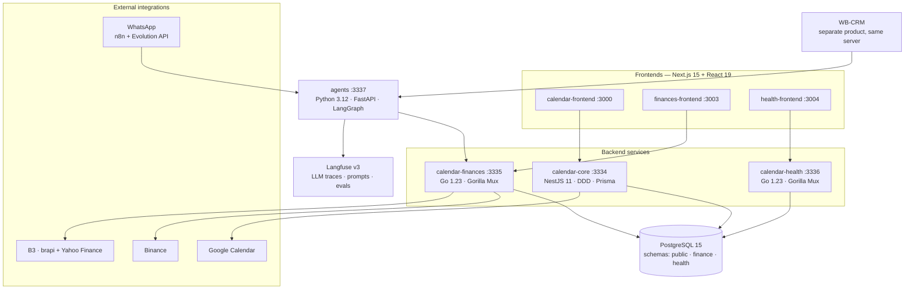

# Calendar

**Personal life-ops platform** — calendar, finances, health and AI agents in one polyglot, multi-container system. Integrates Google Calendar, Binance and B3 market data, with LLM agents (LangGraph + Langfuse) handling transaction entry over WhatsApp and B2B sales research for a second application on the same infrastructure.

[](https://github.com/wbrunovieira/calendar/actions/workflows/ci.yml)
[](https://github.com/wbrunovieira/calendar/actions/workflows/deploy.yml)


## Highlights

- **Polyglot microservices** — NestJS (rich domain), Go (lean high-throughput APIs), Python (AI) — each language chosen for the job, not by habit
- **Domain-Driven Design** in calendar-core: entities, use-cases, repository interfaces and Prisma persistence in cleanly separated layers
- **AI agent service shared across applications**: 8 LangGraph agents serving both this platform and a separate CRM product on the same server
- **LLM observability with Langfuse** (self-hosted): traces, prompt versioning by label, evaluators
- **CI/CD with selective rebuild**: CD diffs against the SHA deployed on the VPS and rebuilds only the services that changed; manual approval gate; deploys over SSH as a non-root user with a pinned host key
- **One PostgreSQL, three schemas** (`public` / `finance` / `health`) — isolation without operational overhead
- **800+ automated tests**, including E2E suites against a real Postgres in CI
- **Real integrations**: Google Calendar OAuth2 (two-way sync), Binance, B3 market data, WhatsApp

## Architecture



**Why polyglot?** Go for the finance and health APIs (small footprint — the finance container runs under a 50 MB memory limit — strong typing, trivial concurrency for background sync jobs); NestJS + DDD for the calendar core, where the domain is genuinely complex (four event types, RRule recurrence with overrides and exceptions); Python + LangGraph for the AI service, where the ecosystem lives.

## AI Agents

The `agents` service is a single FastAPI process hosting **8 LangGraph agents** behind versioned REST endpoints. Graphs are compiled once at startup (lifespan event), never per-request. It serves **two different products**: this platform and WB-CRM, a separate B2B sales CRM running on the same VPS — one AI service, multiple consumers, communicating over the internal Docker network.

**Finances — transaction entry over WhatsApp.** A message like *"mercado 62,90 crédito nubank"* travels WhatsApp → Evolution API → n8n webhook → agent. The graph is a 5-node pipeline (`load_context → parse_message → resolve_entities → create_transaction → format_reply`) with conditional error routing: it loads the user's accounts/categories, parses the free-text message into a typed transaction, resolves entities against the finance API, creates the transaction and replies on WhatsApp — including split and installment handling for credit-card purchases.

**CRM — 7 agents for the sales pipeline** (consumed by WB-CRM):

| Agent | What it does |
|-------|--------------|
| Deep research | 7-node graph with retry loops (up to 3 rounds) and a supervisor review checkpoint; enriches leads with website validation and region detection |
| Call analysis | Scores discovery calls against the SPICED framework |
| Meet analysis | Scores meeting transcripts against a DIAG rubric |
| Gatekeeper analysis + batch | Classifies gatekeeper conversations (RAPORT), single and batch modes |
| Transfer analysis | Detects hand-off quality between conversation stages |
| Proposal | Drafts proposal content from accumulated lead context |

**Engineering details that matter:**

- **Typed I/O end to end** — every endpoint takes and returns Pydantic models; graph state is typed, so LLM output is validated before it touches any downstream API
- **Prompts live in Langfuse, not in code** — fetched by name + label (`production` / `staging`) with in-memory caching, so prompt iterations deploy without a code release
- **Full observability** — every graph run is traced in self-hosted Langfuse (per-node spans, token usage, latency); evaluator modules score outputs for regression testing of prompt changes
- **Failure isolation** — agents call the finance API over the Docker network and surface its real error bodies back to the user instead of generic 4xx messages
- **`n8n` stays thin by design** — scheduling, webhook routing and message delivery only; all business logic and prompts live in the agent service

## Services

| Service | Stack | Port | Purpose |
|---------|-------|------|---------|
| calendar-core | NestJS 11 + Prisma | 3334 | Events, habits, TODOs, reminders, RRule recurrence (DDD) |
| calendar-finances | Go 1.23 + Gorilla Mux | 3335 | Transactions, credit-card invoices, investments, market sync |
| calendar-health | Go 1.23 + Gorilla Mux | 3336 | Workouts, exercises, body measurements |
| agents | Python 3.12 + FastAPI + LangGraph | 3337 | AI agents (see above) |
| calendar-frontend | Next.js 15 + React 19 | 3000 | Calendar UI |
| finances-frontend | Next.js 15 | 3003 | Finance dashboard |
| health-frontend | Next.js 15 | 3004 | Health dashboard |
| postgres | PostgreSQL 15 | 5433 | Shared DB (`public`, `finance`, `health` schemas) |
| Langfuse v3 | 6 containers | 3100 | LLM observability |

## Integrations

| Integration | Used for |
|-------------|----------|
| Google Calendar (OAuth2) | Two-way sync — events push to Google and remote changes pull back |
| Binance | Trade history sync every 30 min → typed crypto purchases with strategy tagging |
| B3 (brapi + Yahoo Finance) | Stock/FII/FIAGRO quote sync and automatic dividend income entries |
| WhatsApp (n8n + Evolution API) | Conversational transaction entry and daily server-health reports |
| Langfuse (self-hosted) | Tracing, prompt management and evals for every agent run |

## Testing

**817 automated tests** across the stack, all running in CI on every push:

| Service | Tests | Notes |
|---------|-------|-------|
| calendar-core | 259 unit + E2E suite | Vitest; E2E boots the Nest app against a real Postgres; coverage gates at 80% lines / 75% branches |
| calendar-finances | 382 | Go; use-cases tested with fakes, repositories with sqlmock, plus tagged integration tests against real Postgres |
| agents | 71 | pytest + pytest-asyncio; graph nodes tested with mocked LLM calls |
| calendar-frontend | 80 | Vitest + Testing Library |
| finances-frontend | 11 | Vitest |
| calendar-health | 14 | Go integration tests against real Postgres (service runs its own SQL migrations) |

## CI/CD

- **CI** (`.github/workflows/ci.yml`) — 8 parallel jobs: NestJS build + unit and E2E (with a Postgres service container and Prisma migrations), two Go suites, pytest, and lint + test + build for each of the three Next.js apps.
- **CD** (`.github/workflows/deploy.yml`) — triggers only after CI passes on `main`, then waits for **manual approval** (GitHub environment). Deploys over SSH as a dedicated **non-root user** with a pinned host key (no TOFU). A diff against the SHA currently deployed on the VPS determines **which services get rebuilt** — a one-service change rebuilds one image, not nine. Prisma migrations run automatically when the diff touches `prisma/migrations/`; compose-only changes (memory limits, env) are applied with a targeted `up -d` without waking intentionally-stopped services; every deploy ends with a health check across all endpoints.

## Development

```bash
cp .env.example .env       # configure secrets (see CLAUDE.md)
docker-compose up -d       # backends run in Docker
cd services/calendar-frontend && npm run dev   # frontends run locally for fast HMR
```

Tests:

```bash
docker-compose exec calendar-core npm test
cd services/calendar-finances && go test ./...
cd services/calendar-health && go test ./...
docker-compose exec agents python -m pytest tests/
```

Architecture details and conventions: see [CLAUDE.md](./CLAUDE.md).

---

— **Walter Bruno Vieira** · [brunodev.wbdigitalsolutions.com](https://brunodev.wbdigitalsolutions.com/) · [LinkedIn](https://www.linkedin.com/in/walter-bruno-vieira)
